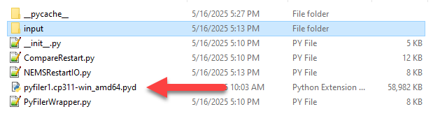
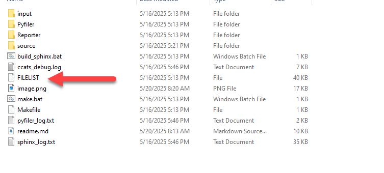
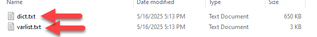
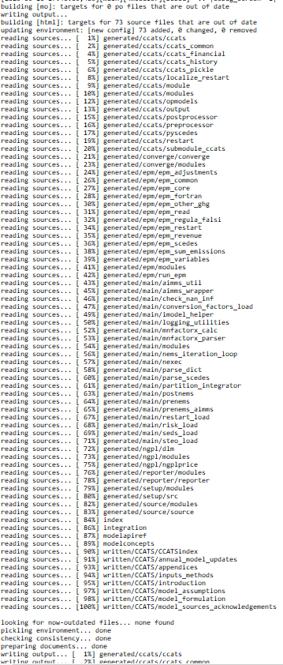
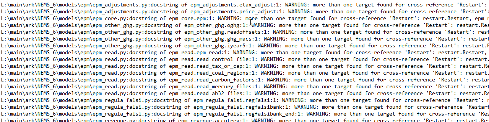

# User guide to implementing Sphinx in NEMS

This guide walks you through the process of setting up Sphinx for automated documentation of NEMS.

---

## Step 1: Update the documentation Directory

NEMS has a directory setup for documentation at NEMS/docs.  Written material that is not contained within code goes into docs/source/written, and is organized by directories.  Auto-generated content, created fromn code, is in docs/source/generated, and is also organized by directory.

---

## Step 2: Prepare Sphinx for your codebase

It takes a few steps to add a new module of NEMS to the sphinx documentation.

1.  Edit docs/build_sphinx.bat to add your new directory. Each line is consideed a module within NEMS. The first location is where the new documentation files will go, for example, source/generated/reporter.  The second location is where the code files are located.


    ```bat
    rmdir /s /q build
    call C:\python_environments\aeo2025_py311_D\Scripts\activate
    sphinx-apidoc -f -o source/generated/reporter ../models/reporter
    sphinx-apidoc -f -o source/generated/converge ../models/converge
    sphinx-apidoc -f -o source/generated/source ../source
    sphinx-apidoc -f -o source/generated/main ../models/main
    sphinx-apidoc -f -o source/generated/ngpl ../models/ngpl
    sphinx-apidoc -f -o source/generated/epm ../models/epm
    sphinx-apidoc -f -o source/generated/setup ../scripts/setup/src
    sphinx-apidoc -f -o source/generated/ccats ../models/ccats
    sphinx-build -b html source/ build/html > sphinx_log.txt 2>&1
    ::pause
    ```

1. Ensure that every directory you want to document contains an `__init__.py` file. This file can be used to describe the module or package, and its contents will appear in the generated documentation. See the sample NEMS repository structure [here](#proposed-new-nems-file-structure). 

    Example `__init__.py` file for hsm model:
   ```python
   """
   ------------------------
    Hydrocarbon Supply Model
    ------------------------

    We are replacing the Oil and Gas Supply Module (OGSM) with the new Hydrocarbon Supply Module (HSM) in the Annual Energy Outlook 2025 (AEO2025). HSM provides projections for production of crude  oil, natural gas, and natural gas plant liquids by fuel type, region, and select geological formations. HSM
    and the Carbon Capture, Allocation, Transportation, and Sequestration Module are the first energy modules written entirely in Python in the National Energy Modeling System (NEMS). Functionally, HSM is similar to OGSM, building on the analytic foundation developed over many AEO publications. The new module, however, contains several major updates and streamlined representations. These changes will make HSM easier to maintain than OGSM and improve transparency of results.

    [... continues ...]
    
    .. image:: _static/images/hsm.png
        :alt: hsm map
        :align: center

 
   """
   ```

1. You may need to edit docs/source/conf.py to reflect the system paths that you need in order to run your code, as Sphinx executes the code during the documentation process.  As sphinx actually runs your code, it can lead to very weird results.  Example paths.

    ```python
    sys.path.insert(0, os.path.abspath(os.path.join("..", "..","models")))
    sys.path.insert(0, os.path.abspath(os.path.join("..", "..","models","reporter")))
    sys.path.insert(0, os.path.abspath(os.path.join("..", "..","models","reporter",'RW Tables')))
    sys.path.insert(0, os.path.abspath(os.path.join("..", "..","models","converge")))
    sys.path.insert(0, os.path.abspath(os.path.join("..", "..","models","main")))
    sys.path.insert(0, os.path.abspath(os.path.join("..", "..","models","ngpl")))
    sys.path.insert(0, os.path.abspath(os.path.join("..", "..","models","epm")))
    sys.path.insert(0, os.path.abspath(os.path.join("..", "..","models","ccats")))
    sys.path.insert(0, os.path.abspath(os.path.join("..", "..","scripts")))
    sys.path.insert(0, os.path.abspath(os.path.join("..", "..","scripts",'pyfiler')))
    sys.path.insert(0, os.path.abspath(os.path.join("..", "..","scripts",'setup')))
    sys.path.insert(0, os.path.abspath(os.path.join("..", "..","scripts",'setup','src')))
    ```

1.  You probably want to link your material into the indexes that are used in this project.  

    Non-code content is linked out of  docs/source/modelsconcept.rst. The format is desired title, followed by a relative link.    
    ```
        The model design and concepts provide additional details on the theory and math in EIA models.

        .. toctree::
            :maxdepth: 2
            

            Carbon Capture, Allocation, Transportation, and Sequestration Module <written/CCATS/CCATSindex>
    ```

    Generated documentation is linked out of docs/source/modelapi.rst

    ```
    The model API Reference provide additional details on the operations of EIA models.

    .. toctree::
        :maxdepth: 2
        

        Integration <integration>
        Carbon Capture, Allocation, Transportation, and Sequestration Module <generated/ccats/modules>
        Emission Policy Module <generated/epm/modules>
    
    ```


## Step 3: Give Sphinx the needed extensions and configurations


Edit the `conf.py` File.  The `conf.py` file is the core configuration file for Sphinx. Open it again and revew the following.  See if you need any new extensions, or other modifications to options:


```python

# -- General configuration ---------------------------------------------------
# https://www.sphinx-doc.org/en/master/usage/configuration.html#general-configuration

extensions = [
    "sphinx.ext.autodoc",
    "sphinx.ext.autosectionlabel",
    "sphinx.ext.autosummary",
    "sphinx.ext.napoleon",
    "sphinx.ext.todo",
    "sphinx.ext.viewcode",
]
autosummary_generate = True
autosummary_imported_members = True
numpydoc_class_members_toctree = False
numpydoc_show_class_members = False


autodoc_default_options = {
    'members': True,
    'private-members': True,
    'undoc-members' :True,
    }

templates_path = ["_templates"]
exclude_patterns = []

html_theme = "sphinx_rtd_theme"
html_static_path = ["_static/images"]

```

## Step 4: Manually move needed files
A few of the modules that have auto-generated documentation need files that are not available in the NEMS repo without running NEMS. To avoid storing static version of these files, which would fall out of date, they are NOT included in teh repo in the needed places.  As a result, you need to move a few files around.

Before you start, you're going to want some files that NEMS only generates at runtime.  It may be easiest to do so with the "create run folder only" checkbox, so that you generate all the needed files, but don't actually create the run.

We should automate this at some point, but we aren't there yet.

To run sphinx succesfully, move these files into place:

1. Compile the NEMS code into `pyfiler1.XXX.pyd` in `scripts/pyfiler`.   

    

1.  put `input/dict.txt` into `scripts/pyfiler/input`

1. put `scedes/filelist` into the `docs` folder and the `docs/pyfiler` folder.  `filelist` doesn't live in the repo, and is only available after a NEMS run has been kicked off - so if you haven't done that, you won't see it.

    

1.  Put `input/dict.txt` and `input/varlist` into `docs/input` and `scripts/pyfiler/input`.

    

1. Put `reporter/config.ini` into `docs/reporter`


## Step 5: Build the docs and review the log

Now comes the fun part! You can build the sphinx documents by running `docs/build_sphinx.ps1`.  Errors, warnings, etc, will go to `docs/sphinx_log.txt`.  If things go well, there should be no extraneous log messages, errors or warnings.

If so, it should look somewhat like this.



If it doesn't go well, you'll see message like this, which will require debugging.  In general, you should try to leave things better than you found them.




## Step 6:  Review the docs

You can find the html under `docs/build/index.html`.  If you did it right, everyhting should flow beautifully from there.

