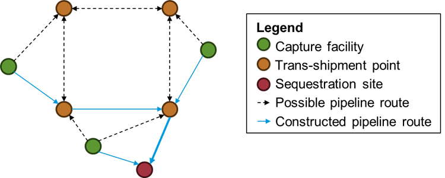
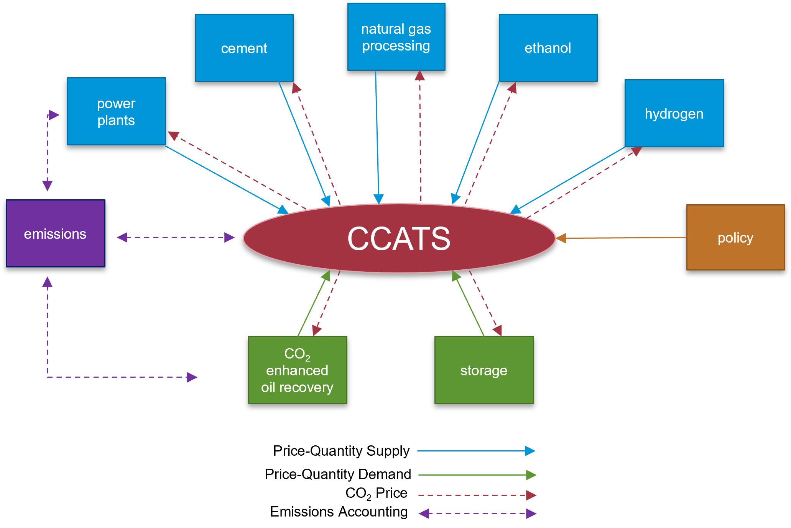

Introduction
============

The Carbon Capture, Allocation, Transportation, and Sequestration (CCATS) module models the captured carbon dioxide (CO₂) system within the National Energy Modeling System (NEMS). CCATS endogenously allocates and transports the projected supply of captured CO₂ from NEMS modules to utilization and storage sites throughout the United States.

At its core, CCATS is an optimization model that minimizes various operation and investment costs for capturing, transporting, and sequestering or utilizing CO₂. After applying policy incentives, the module determines the most cost-effective network flow of CO₂ from supply sources to demand locations and projects the development of CO₂ infrastructure for both transportation and saline storage until 2050. 

CCATS was first introduced in NEMS for the Annual Energy Outlook 2025 (`AEO2025 <https://www.eia.gov/outlooks/aeo/>`_) to better reflect the emerging market for captured carbon dioxide (CO₂). Prior to the Inflation Reduction Act (IRA), policy incentives for carbon capture and storage were insufficient to support the development of carbon storage at scale. The module was designed to be flexible to incorporate future policies and to more accurately project potential long-term trends in U.S. energy markets. CCATS replaced the Capture, Transport, Utilization, Storage (CTUS) from prior AEOs.

Model Overview
--------------

CCATS represents three distinct components of CO₂ flow as interconnected nodes in a network (illustrated in :numref:`Figure %s <label-figure-simple-nodal-network>`).

#. **Capture facilities**: Facilities where CO₂ is captured

#. **Trans-shipment points**: A pipeline network that connects capture sites to sequestration locations, including both existing infrastructure and potential expansion routes.

#. **Sequestration sites**: Destinations where CO₂ is stored

.. _label-figure-simple-nodal-network:

   CCATS nodal network representation

Capture facility nodes represent sources of CO₂ supply from other modules in NEMS. Specifically, CCATS receives quantities of captured CO₂ from electric power generation, ethanol production, natural gas processing, hydrogen production, and cement production. CCATS currently does not represent direct air capture (DAC). 

CO₂ demand in CCATS comes from either CO₂ enhanced oil recovery (EOR) wells or storage in saline formations. Today, the overwhelming majority of captured CO₂ is directed toward CO₂ EOR, a process in which CO₂ is injected into oil and natural gas wells to extract additional hydrocarbon resources. Demand from other sources of CO₂ utilization such as the food and beverage industry and electrofuels, or e-fuels, are currently not modeled in CCATS. 

CCATS accounts for both operating and investment costs for capacity expansion for trans-shipment and sequestration node types. Note that capture costs are represented in other NEMS modules and have already been taken into account when CO₂ supply is received from other modules. 

The model optimizes the flow of CO₂ from supply sources to sequestration sites using a linear program that minimizes total system costs while incorporating applicable tax credits and other revenues as negative costs. The model solution determines optimal transportation routes and sequestration locations. The model solution also provides CO₂ prices, which are passed off to NEMS modules and inform their carbon capture and investment decisions in equilibrium. 

The interaction between CCATS and the other NEMS modules is shown in :numref:`Figure %s <label-figure-ccats-model-overview>`.

.. _label-figure-ccats-model-overview:

   Overview of CCATS interaction with other modules in NEMS

Geographic Representation
-------------------------

CCATS represents the three main geographical areas where current carbon capture and sequestration operations are active in the U.S.: the Gulf Coast, the Permian Basin, and the Rocky Mountains/Great Plains. Each of these markets is local, and no existing pipelines move CO₂ between these regions. CCATS is designed to build on this local transportation infrastructure to support additional volumes.

