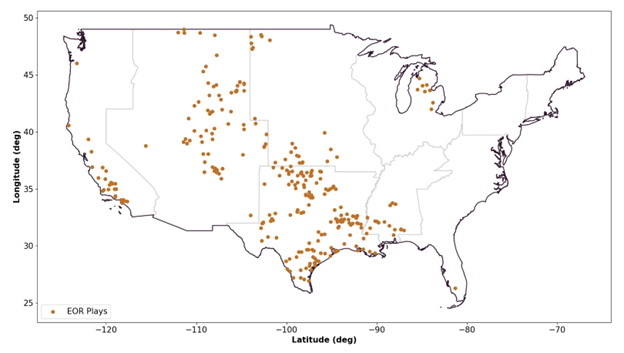

Model Assumptions
=================

Capture Facilities
------------------

CCATS makes various assumptions on the granularity, geographic location, and costs associated with captured CO₂ supplies received from NEMS for the following industries and corresponding NEMS modules:

* Electric power generation - Electricity Market Module (EMM) 
* Ethanol production - Liquid Fuels Market Module (LFMM) 
* Natural Gas Processing - Hydrocarbon Supply Module (HSM) 
* Hydrogen Production - Hydrogen Market Module (HMM) 
* Cement production - Industrial Demand Module (IDM) 

CCATS receives CO₂ supplies from NEMS at either at the census region or census division level. However, the CCATS optimization model operates on a more granular level, specifically at the discrete facility level, to provide more accurate projections geographically. Accordingly, CCATS disaggregates captured CO₂ supply to specific CO₂ supply facilities using the following methodology.

First, we assign CO₂ supply to facilities with existing infrastructure to represent observed CO₂ in the data. Second, as the captured CO₂ industry grows with volumes beyond the capacity of existing facilities, CCATS ranks facilities based on estimated costs to install capture technology and costs to connect supply facilities to the pipeline network. This determines which facilities will find it most economical to invest in capturing CO₂ first. 

Installation cost assumptions vary based on industry and the availability of expert studies and analysis. For natural gas power plants, coal power plants, and bioenergy with carbon capture and storage power plants in the electric power sector, we use modified versions of NETL power plant studies. :footcite:p:`NETL2022`, :footcite:p:`NETL2023` These data provide the locations, expected cost of capture and estimated CO₂ capture potential of existing power plants suitable for carbon capture retrofit.

For ethanol, natural gas processing, hydrogen (represented by ammonia), and cement facilities, we use the NETL Industrial Carbon Capture Retrofit Database :footcite:p:`NETL2023_CCRD` to identify facilities suitable for retrofit with carbon capture. We subsequently combine estimated capture cost and CO₂ capture potential from this dataset with geographic location data from EPA’s Greenhouse Gas Reporting Program. :footcite:p:`EPA_FLIGHT` We also use EPA Subpart PP :footcite:p:`EPA_SubpartPP` and an analysis by CATF :footcite:p:`CATF_CCSTable` to determine whether a facility has been capturing CO₂, and if so, for how long. Finally, we make modifications to assessed CO₂ capture potential based on EIA-64A, EIA-757, and EIA-816 survey data.

In addition to investment in existing facilities, CCATS also has the option to install carbon capture at new facilities as the industry further grows. Characteristics of these new facilities and their corresponding capture costs are provided by the other NEMS modules to CCATS as input parameters.

To save on runtime, facilities with a capture cost greater than $70/MMmT ($2023) are excluded from the optimization.

.. _label-table-capture-potential:

.. csv-table:: CO₂ capture potential at represented existing facilities for the optimization
   :file: tables/table-capture-potential.csv
   :name: table-capture-potential 
   :header-rows: 1

.. rubric:: Source: National Energy Technology Laboratory: :footcite:t:`NETL2022`, :footcite:t:`NETL2023`, :footcite:t:`NETL2023_CCRD`; U.S. Environmental Protection Agency: :footcite:p:`EPA_FLIGHT`, :footcite:p:`EPA_SubpartPP`, Clean Air Task Force: :footcite:p:`CATF_CCSTable`.

Pipeline Network
----------------

Nodal Map
~~~~~~~~~

Captured CO₂ is transported from capture sites to either EOR or saline storage via pipelines. In CCATS, CO₂ can be transported directly from a supply source to a sequestration site, or indirectly via a series of trans-shipment points. This representation reflects current industry dynamics where some smaller CO₂ supply sites send captured CO₂ to a single storage or EOR site, while other groups of CO₂ capture infrastructure are connected via a regional pipeline network. 

We build our transportation network by first representing the existing U.S. CO₂ pipeline network as trans-shipment points on the U.S. map. We add to this set a uniform grid of nodes representing the potential trans-shipment network that can be built for capacity expansion. Finally, we include all the CO₂ capture sites, CO₂ EOR sites, and saline formation storage sites to the network. 

We connect the all the various nodes then limit the set of connections used in the model based on pipeline length and node type. For example, sequestration nodes cannot connect to other sequestration nodes. 

Cost Assumptions
~~~~~~~~~~~~~~~~

To calculate installation and operations costs, we first group the set of connected nodes by pipeline length and region. All connections that are of similar distances and are in the same region use the same cost assumptions.

Regionalized pipeline costs are based on the FECM/NETL CO₂ Transport Cost Model :footcite:p:`Morgan2023`, modifying a natural gas pipeline study from :footcite:t:`Brown2022` to account for the higher costs of CO₂ pipelines.  This model is highly granular and includes information on operating and financing costs by pipeline diameter, length, and pump count. 

.. _label-table-select-cost-curves:

.. csv-table:: Select cost curves by region from Brown et al
    :file: tables/table-select-cost-curves.csv
    :name: table-select-cost-curves 
    :header-rows: 1
    :widths: 8, 6, 6

.. rubric:: Source: U.S. Energy Information Administration.

For each pipeline length, we apply cost factors from the FECM/NETL study to combinations of pipeline diameters and pump counts. We assume a 20-year project lifespan. This yields various cost possibilities for transporting a certain volume of CO₂ by a certain distance. We separate these total costs into electricity costs, fixed operating and maintenance costs, and capital costs. 

To obtain installation cost parameters, we choose the least costly option in terms of fixed and capital costs based on the previous calculation. Based on this cost curve, we run a linear regression to produce the installation cost linear parameters provided to the model. 

Variable costs include both maintenance costs and electricity costs. We calculate electricity operating costs based on the maximum flowrate for each diameter-pump-length combination, and some assumptions on pump requirements. Specifically, we treat CO₂ that is within the pipelines as a supercritical fluid, modeling the fluid as incompressible. We assume pump stations are built along the pipeline at a frequency of no more than two pumps per 100 miles. We then calculate pump power requirements and total electricity costs using electricity prices received endogenously from NEMS. 

.. _label-table-max-flow-rates:

.. csv-table:: Select maximum flow rates (MMtonne/year)
    :file: tables/table-max-flow-rates.csv
    :name: table-max-flow-rates
    :header-rows: 2

.. rubric:: Source: U.S. Energy Information Administration.

In addition to installation and operating costs, we add cost multipliers to any pipelines that cross over water, or over land but is covered under the National Park Service :footcite:p:`USGSA_ParkBoundaries` or National Register of Historic Places. :footcite:p:`USGSA_HistoricPlaces` These multipliers account for rerouting or additional permitting costs associated with these routes. 

Saline storage assumptions
--------------------------

Saline formations are the only storage option for CO₂ in CCATS. To accurately model CO₂ storage, we calculate the amount of CO₂ that can be stored in each formation, and the costs of setting up an injection site, the process of injecting CO₂, and storing CO₂ in the formation. 

To do this, we relied on the FE/NETL CO₂ Saline Storage Cost Model :footcite:p:`NETL2017_SalineStorage` for a comprehensive list of geologic formations, as well as the base geologic/engineering calculations for injection rates, and maximum CO₂ storage amounts in the formations. The model was also used to estimate the costs for each individual injection project. A summary of the storage formations that are input into the model are shown below. The full list of storage formations and their characteristics can also be donwloaded here: :download:`table-storage-formations-full.csv <tables/table-storage-formations-full.csv>`.

.. _label-table-storage-formations:

.. csv-table:: Summary of Storage Formations
    :file: tables/table-storage-formations.csv
    :name: table-storage-formations
    :header-rows: 1
    :widths: 20, 8, 8, 8, 8, 8

.. rubric:: Source: U.S. Energy Information Administration.

CO₂ EOR assumptions
-----------------------------

Maximum demand for captured CO₂ from EOR sites is provided at the geological formation level by HSM. CCATS is not required to meet all CO₂ demanded for EOR because CCATS currently does not represent natural sources of CO₂. Note that natural sources of CO₂ fulfilled 62% of CO₂ supplied to EOR in 2023. :footcite:p:`EPA_Sequestration`

.. _label-figure-ccats-eor-sites:

    Map of CO₂ EOR sites

.. rubric:: Source: U.S. Energy Information Administration.

Price assumptions
-----------------

CO₂ prices are calculated after the CCATS linear program has solved. Specifically, we calculate a regional volume-weighted average of the shadow prices produced by the model. This price is inclusive of transportation and sequestration costs, net policy revenue and revenue from selling CO₂ to EOR sites. This price does not include capture costs, as these costs are calculated by the NEMS modules that interface with CCATS as part of their carbon capture decisions. 

Technology improvement rate assumptions
---------------------------------------

CCATS includes a technology improvement rate that reduces the cost of a technology over time. A report by :footcite:t:`DOE_CarbonMgmt2023` at DOE estimates that major cost reductions are possible for carbon capture, but only moderate and small reductions for transport and storage, respectively. As such, we include an annual improvement rate of 1% for pipeline transport and saline storage.

Capacity expansion and financing assumptions
--------------------------------------------

Assumptions for transportation and storage infrastructure investments are listed in :numref:`label-table-model-assumptions-financing` The fixed O&M fraction is the relative amount of fixed operation and maintenance costs within as compared with the capital investment cost. The buffer assumption is the amount of extra capacity that must be built.

.. _label-table-model-assumptions-financing:

.. csv-table:: CCATS Financing Assumptions
   :header: "Parameter", "Value"
   :widths: 40, 8
   :name: table-model-assumptions-financing 

   "Debt ratio","40%"
   "Return over capital cost","5%"
   "Risk premia","2%"
   "Financing years - Transportation","20"
   "Financing years - Storage","26"
   "Fixed O&M - Transportation","2.5%"
   "Fixed O&M - Storage","8.7%"
   "Capacity Expansion Buffer","15%"

.. rubric:: Source: U.S. Energy Information Administration.

Legislation and Regulations
---------------------------

In representing existing policy, CCATS focuses on the expansion and enhancement of 45Q tax credits in the following three legislative acts.

Energy Improvement and Extension Act of 2008 
~~~~~~~~~~~~~~~~~~~~~~~~~~~~~~~~~~~~~~~~~~~~

The Energy Improvement and Extension Act of 2008 :footcite:p:`EnergyImprovementAct2008` included the establishment of the 45Q tax credit for the capture and sequestration of CO₂ from industrial facilities. This law established that CO₂ must be captured and disposed of within the United States. 

Bipartisan Budget Act of 2018 
~~~~~~~~~~~~~~~~~~~~~~~~~~~~~~~

The Bipartisan Budget Act of 2018 :footcite:p:`BipartisanBudgetAct2018` included extending the availability of the 45Q tax credit to facilities that began construction before 2024 and increased the tax credit. For EOR, the tax credit began at $10/mT and increased to $35/mT in 2027. For saline storage, the tax credit began at $20/mT and increased to $50/mT in 2027. After 2027, the tax credit is inflation adjusted. The tax credit is available for 12 years.

Inflation Reduction Act of 2022 
~~~~~~~~~~~~~~~~~~~~~~~~~~~~~~~

The Inflation Reduction Act (IRA) of 2022 :footcite:p:`InflationReductionAct2022` extended the 45Q tax credit to eligibly facilities that begin construction before 2032 and meet minimum quantity thresholds. IRA increased the tax credits from previous legislations to $60 per metric ton for captured CO₂ sent to EOR sites, and to $85 per metric ton for captured CO₂ permanently sent to geologic storage sites. The cax credits last for 12 years after the carbon capture equipment associated with the project is placed into service. Tax credits are adjusted for inflation starting in 2027 and are indexed to 2025 as the base year.

Sources
-------

    .. footbibliography::

