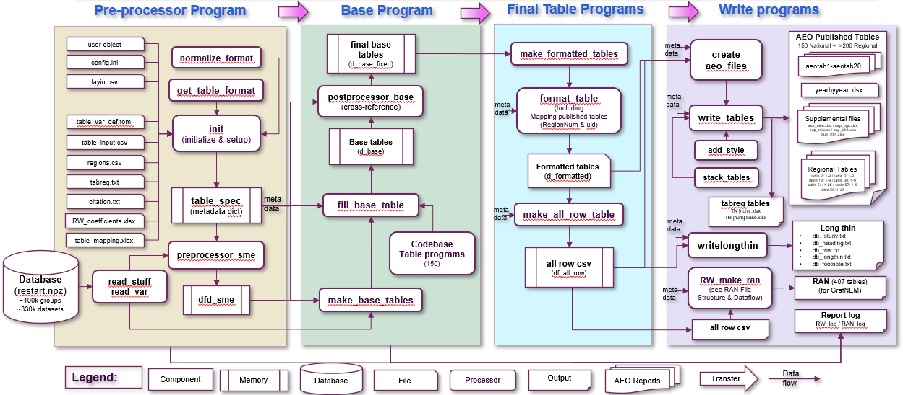
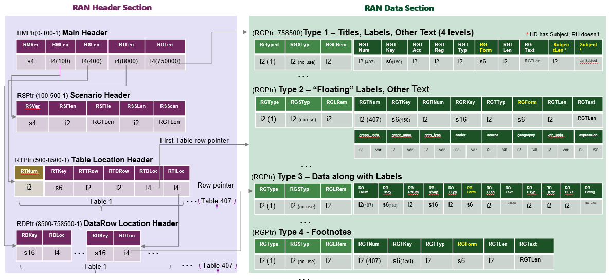

The NEMS Report Writer
======================

The NEMS Report Writer, debuted in AEO2025, produces outputs from NEMS.
It gathers data from the restart file (the NEMS common database) to
generate various outputs, including Excel files for publication, Excel
files for analysis, CSV files for data visualization, and other reports
to support debugging and analysis. It receives data from the restart
file (a binary database containing tables stored in npz format) and a
set of standalone input files.

It is independently callable outside of a larger NEMS run, allowing for
testing and modifications to tables without the need to rerun the entire
NEMS system.

NEMS Report Writer Structure
----------------------------

The NEMS Report Writer is structured modularly. It sequentially runs a
preprocessor that prepares the data, a base program that converts that
data into tables, a final table program that formats those tables, and
then has a series of write routines to convert the formatted tables into
publication tables.

   Figure 7: Report Writer system diagram

Running the Report Writer
-------------------------

The Report Writer is designed to run independently or to be callable
inside of a large NEMS run. It requires essential information specific
to the NEMS run, which is not available in the restart database or input
files (such as the restart file location, Study_ID, etc.) for generating
NEMS tables. This information must be provided to NEMS_RW at the time of
initiation.

Two methods have been designed to convey the required information to the
reporting platform:

1. Updating the User object by modifying the User object in
   RW_reporter_main.py (see the top right).

2. Updating the user.csv File by modifying the user.csv file located in
   the package's main folder (see the bottom right). This file should be
   used as an augment when running the program.

Data in the user.csv file will overwrite the User object if the Report
Writer is kicked off with an argument like the following: *Python
RW_reporter_main.py user.csv.*

Config.ini should be adjusted to set operational parameters, and
tabreq.txt should be adjusted to indicate tables to print.

Preprocessor Program
--------------------

The preprocessor processor program processes the inputs; both
configuration files that tell the report writer what to do, as well as
data files that are used to populate the final tables. These inputs
include the following:

.. table:: Table 4: Preprocessor input files

   +---------------------+---------------------------------------------------+
   | Filename            | Brief description                                 |
   +=====================+===================================================+
   | user.csv            | Configuration information that is used when the   |
   |                     | report writer is used outside the larger NEMS     |
   |                     | framework                                         |
   +---------------------+---------------------------------------------------+
   | tabreq.txt          | Indicates which tables are printed                |
   +---------------------+---------------------------------------------------+
   | table_var_def.toml  | Holds lists of required variables by table        |
   +---------------------+---------------------------------------------------+
   | table_mapping.xlsx  | Holds mapping from layin tables to AEO published  |
   |                     | tables                                            |
   +---------------------+---------------------------------------------------+
   | table_input.csv     | Specifies table ID, region name, and Table        |
   |                     | Program name                                      |
   +---------------------+---------------------------------------------------+
   | RW_coefficients.xls | Holds conversion ratios and constants             |
   +---------------------+---------------------------------------------------+
   | regions.csv         | Holds regional information                        |
   +---------------------+---------------------------------------------------+
   | layin.csv           | Specifies the key elements of each row for each   |
   |                     | table                                             |
   +---------------------+---------------------------------------------------+
   | citations.txt       | Citations and corresponding values used in        |
   |                     | publication                                       |
   +---------------------+---------------------------------------------------+
   | config.ini          | This file consists of two sections: Debugging and |
   |                     | Settings                                          |
   +---------------------+---------------------------------------------------+

Base Program and Table Programs
-------------------------------

There are 150 table programs, one corresponding to each data table
modelers use to publish and/or review specific data coming out from the
model. For example, Table 1 titled “Total Energy Supply, Disposition,
and Price Summary” has rows from various NEMS modules giving information
about different fuels such as Natural Gas, Coal, Nuclear, Other
Renewable Energy to give the reader an insight as to the data for the
selected range of dates. Other tables break down individual module
sections into smaller regional based data or fine details about all of
the output from a module. To do this, NEMS Report Writer uses the layin
file, the table_var_def.toml file, and the RW
Tables/RW_fill_table_base_XXX.py (where XXX is the table number) to
understand what rows the program should print out to output files. The
Layin.csv file gives the layout and formatting for output, the
table_var_def.toml file defines what variables will be used from the
global data structure for the output, and the RW_fill_table_base_xxx.py
file holds the calculations to compute to fill out the data. By using
the make_base_tables in the base program, an unformatted table is
generated first, holding in memory all of the associated pieces that
would generate a table for review by a user.

Postprocessor
-------------

Some tables require data from other tables that are calculated and
cannot be retrieved from the restart, resulting in difficulties
completing calculations for certain data rows within the individual
table programs.

To address these issues, a special component called
postprocessor_base.py was designed. This component runs after the base
table programs to “fill in” placeholders defined in those table program.

Additionally, some calculations can be performed in batches within this
component and then utilized by individual tables to improve performance.

RAN File Generator
------------------

RAN is a randomly accessible binary file used for visualizing NEMS
projections in GrafNEM.

The RW_make_ran.py code was developed to generate the RAN file, which
stores all NEMS tables) in binary format, based on the provided
documentation and FTAB references. RW_make_ran.py is a component that
can be run independently or integrated into the NEMS_RW platform
(invoked by the main function of RW_reporter_main.py). It reads table
data from the "all row csv.csv" file generated by the reporting platform
and obtains table and row formatting information from layin.

   Figure 8: RAN File Generator diagram
