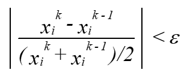
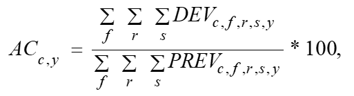
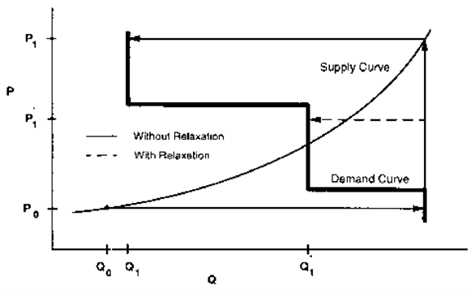
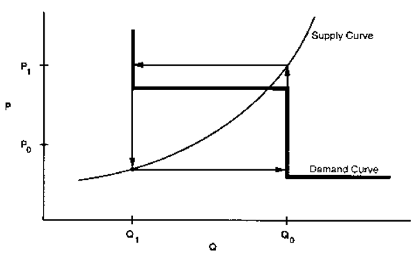
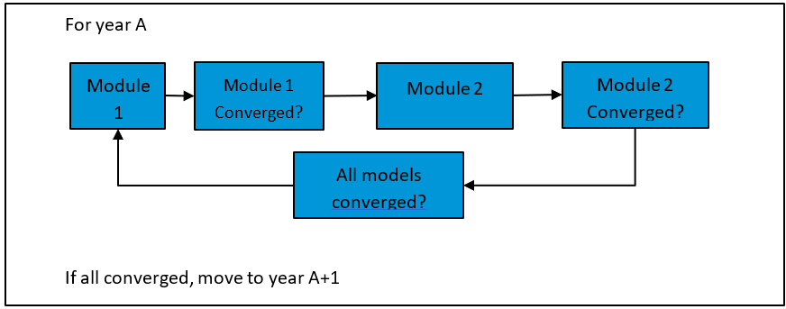
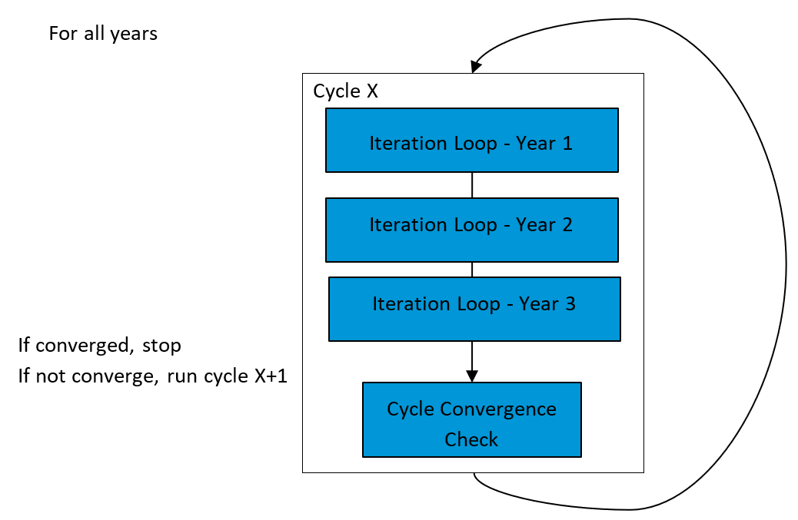

Integrating Module Solution Methodology
==========================================

The Integrating Module contains the *converge* submodule, which
implements the NEMS solution algorithm. The algorithm relies upon
consecutive execution of the NEMS component modules iteratively to
achieve energy market equilibrium for each projection year. Using the
NEMS Global Data Structure as its inputs, the converge submodule tests
whether convergence has occurred, and it optionally adjusts the solution
values to aid the convergence process.

Within the converge submodule, there are two convergence tests for a
cycle, and for an iteration.

The NEMS iteration
------------------

.. _introduction-1:

Introduction 
~~~~~~~~~~~~~

The *iteration* solution is the inner loop of NEMS, and where NEMS
iterates each modul4 over each year repeatedly before going to the next.
Each module is checked for convergence before the next module runs, and
then relaxation is applied, if appropriate.

Figure 2: Simplified representation of the iteration loop

|iteration loop| 

The modules in NEMS represent the demand, supply, and conversion
segments of the energy market as well as modules to provide economic,
international market, and other feedbacks. In effect, these modules
represent energy supply and demand curves. That is, the supply and
conversion modules determine prices and sources of supply, given the
quantity of fuel demanded. The demand and conversion models determine
the fuel demands, given the prices of those fuels. The solution
algorithm attempts to determine a vector of fuel prices and quantities
so that supply and demand curves in all fuel markets equilibrate. That
is, a solution occurs when energy demands and prices, along with the
macroeconomic variables, reach stable, convergent values.

The Iteration Solution algorithm
-----------------------------------------------

To reach a solution for each iteration, the convergence submodule solves
simultaneous equations implied by the supply, demand, and conversion
modules. The approach applies the Gauss-Seidel algorithm, which solves a
set of simultaneous equations. Gauss-Seidel is an iterative method of
solving simultaneous linear equations by replacing the independent
variables with their previous solved-for values. Although equations
within NEMS can be non-linear, this method is expected to provide an
equilibrium solution because the equations are either monotonically
increasing (as are the supply curves) or monotonically decreasing (as
are the demand curves).

In effect, the approach groups the equations and variables into subsets.
For NEMS, the subsets consist of predefined fuel supply, energy
conversion, and sectoral demand modules. Each subset of equations is
solved, keeping the other variables constant at their trial values and
ignoring the effects of current variables on equations in other subsets.
The process is repeated for each subset, updating the trial values for
each variable from the previous solution.

More formally, for a stylized NEMS, the nonlinear system of equations
could be represented by

   x\ :sub:`i` = g\ :sub:`i` (x\ :sub:`1`, …, x\ :sub:`i-1`,
   x\ :sub:`i+1`, …, x\ :sub:`n`) for i = 1, ..., n, (1)

having the market clearing or equilibrium solution vector

   x = (x\ :sub:`1`, ..., x\ :sub:`n`).

The solution process assumes a set of initial values, denoted
*x*\ :sup:`0`, where

   x\ :sup:`0` = (x\ :sub:`1`\ :sup:`0`, ..., x\ :sub:`n`\ :sup:`0`).

A trial solution for iteration *k* for a certain year is denoted by
*x\ k*, where

   x\ :sup:`k` = (x\ :sub:`1`\ :sup:`k`, ..., x\ :sub:`n`\ :sup:`k`).

Each *g\ i\ (x)* uses one or more of the elements of the trial solution
vector *x\ k*, excluding its own solution, *x\ i\ k*.

A solution iteration *k* begins with the evaluation of *g\ 1* and
continues solving each *g\ i*, ending with *g\ n*. The solution of
*g\ i* in iteration *k* updates the solution estimate to

   x = (x\ :sub:`1`\ :sup:`k`, x\ :sub:`2`\ :sup:`k`, ...,
   x\ :sub:`i-1`\ :sup:`k`, x\ :sub:`i`\ :sup:`k`,
   x\ :sub:`i+1`\ :sup:`k-1`, ..., x\ :sub:`n`\ :sup:`k-1`) .

The updating process continues until an iteration-*k* trial solution is
derived for all *x\ i*.

After evaluating *g\ i\ k*, the values of the solution variables are
compared with the values from iteration *k-1*. A final solution, *x\ k*,
has been achieved if, after all modules have been executed, the absolute
values of the proportional changes in the *x\ i* remain smaller than a
specified tolerance, ε:

   |image2|

for *i* = 1, ..., *n*. Values of ε can be chosen on a
variable-specific basis. The typical values used are in the range of 1%
for the census division variables, less for the national macroeconomic
variables. In the convergence tests, the denominators use an average to
avoid convergence difficulties if either the starting value or a trial
solution value is equal to zero.

After the convergence criteria have been met, another iteration is
performed to test whether the solution is stable and to allow the
modules to perform final processing for the projection year. As a
result, the final converged solution vector for the projection year is
*x\ k*\ :sup:`+1`, where k is the first iteration for which the solution
meets the convergence criterion.

A procedure referred to as *relaxation* is used to control the
equilibration process and aid in resolving some convergence problems. If
the relaxation option is selected, changes in values of convergence
variables between iterations are dampened by a user-specified factor.
The selection of appropriate relaxation parameters may speed convergence
and lead to a more stable and robust solution process. The relaxation
*assignment statement* is of the form:

|image4|

where *r\ k\ i* = relaxation factor for a convergence variable *i* for
iteration *k*. Note that the specification of relaxation factors is
variable specific and iteration specific. The module can specify varying
relaxation fractions, depending on the iteration number, as an option.
This feature is used to allow greater dampening after the first few
iterations. Convergence parameters, including the tolerances and
relaxation fractions for each variable, are specified through the input
file *mncnvrg.txt*.

To handle cases where the procedure does not converge on a solution or
does not achieve the specified tolerance, a limit on the number of
iterations terminates the algorithm for the current projection year. In
such cases, the model performs the additional iteration mentioned in the
previous paragraph, reports the convergence status with a list of the
variables failing to converge, and then proceeds to the next projection
year. The final solution for the projection year is, therefore, the
result one iteration beyond the non-converged trial solution.

The NEMS cycle
--------------

.. _introduction-53:

Introduction
~~~~~~~~~~~~

The *cycle* solution is the outer loop of NEMS, and allow NEMS to solve
with perfect foresight structures. Each cycle involves the iterative
execution of all of the projection years.

|cycle loop|

Solution values for successive cycles are compared to determine if
expected values (from the previous cycle) and realized values (from the
current cycle) converge. A program performs the intercycle convergence
checks and scores the degree of intercycle convergence using a
qualitative metric (discussed more below). It is typical, then, to run
NEMS in sets of 4 or more cycles to achieve intercycle convergence. In
addition, a relaxation procedure, similar to the single-year relaxation
procedure, can be applied to speed up convergence between cycles.
Parameters for testing convergence between cycles are separate from
those for testing convergence between iterations.

The cycle solution algorithm
~~~~~~~~~~~~~~~~~~~~~~~~~~~~

A qualitative metric for convergence is presented in a NEMS output
report (NEMS report writer output Table 150) as an aid in evaluating the
degree of convergence. The convergence metric, known as the Grade Point
Average (GPA), scores the convergence tests on a four‑point,
academic‑style grading scale. With this idea, a run's convergence status
is revealed with a single number associated with a sense of quality: a
4.0 GPA is a straight A average, for example. A run with a convergence
GPA of 2.0 (a *C*) is average, while a GPA of 1.0 (a *D*) is a poor
grade. This heuristic grading scale is derived using a weighted average
of the absolute value of percentage differences in convergence
variables, aggregated across sectors and regions. The convergence GPA is
calculated as follows:

1) Compute deviations for convergence variables for each fuel, region,
   and sector in year. Let:

- *DEV\ f,r,s,y* = Absolute value of deviation in a convergence
  variable: fuel *f*, region *r*, sector *s*, year *y*, where a
  deviation is one of the following:

  a. Quantity deviation: absolute value of (the current quantity minus
     the previous quantity)

  b. Price deviation: absolute value of the current expenditure (that
     is, price times quantity) minus the previous expenditure (the
     expenditures exclude any permit price adders)

  c. Emission allowance price deviation: absolute value of the current
     allowance price minus the previous allowance price.

..

   *PREV\ f,r,s,y* = Previous value for a convergence variable: fuel
   *f*, region *r*, sector *s*, year *y*

2) Group the convergence variables into five categories, *c*:

   a. End-use sector energy consumption quantities

   b. Electric power sector energy consumption quantities

   c. End-use sector energy prices

   d. Electric power sector energy prices

   e. Environmental permits/allowance prices: carbon dioxide, sulfur
      dioxide, and mercury

3) Aggregate the deviations (*DEV*) across regions, fuels, and sectors
   within each of the five categories, *c*, and express the deviations
   as percentage of the corresponding previous values (*PREV*). Let
   *AC\ c,y* = the aggregated change (or deviation) for category *c* and
   year *y*, expressed as a percentage. That is,

..

   |image5|

   where the sums are over all fuels *f*, regions *r*, and sectors *s*
   that belong in category *c*.

4) Compute a composite score by averaging the aggregated changes (AC) of
   the five categories, using the following weights (the basis for the
   values is described further below).

Table 2: Convergence variable weights by category

+-----------------------------------------------------------+----------+
| Category                                                  | Weight   |
+===========================================================+==========+
| End-use sector energy consumption quantities              | 24.5     |
+-----------------------------------------------------------+----------+
| Electric power sector energy consumption quantities       | 24.5     |
+-----------------------------------------------------------+----------+
| End-use sector energy prices                              | 24.5     |
+-----------------------------------------------------------+----------+
| Electric power sector energy price                        | 24.5     |
+-----------------------------------------------------------+----------+
| Environmental allowance fees                              |          |
+-----------------------------------------------------------+----------+
| Carbon dioxide (if applicable)                            | 0        |
+-----------------------------------------------------------+----------+
| Sulfur dioxide                                            | 1        |
+-----------------------------------------------------------+----------+
| Mercury (if applicable)                                   | 1        |
+-----------------------------------------------------------+----------+

5) Scale or grade the composite score into a grade point average (GPA)
   by interpolating the score from the following table:

.. table:: Table 3: Composite score to GPA

   +---------------------+-------------------------+---------------------+
   | Score (percentage   | Grade on four-point     | Letter grade        |
   | basis)              | scale                   |                     |
   +=====================+=========================+=====================+
   | 0.5 or less         | 4.0                     | A                   |
   +---------------------+-------------------------+---------------------+
   | 2.0                 | 3.0                     | B                   |
   +---------------------+-------------------------+---------------------+
   | 5.0                 | 2.0                     | C                   |
   +---------------------+-------------------------+---------------------+
   | 10.0                | 1.0                     | D                   |
   +---------------------+-------------------------+---------------------+
   | 15.0 or more        | 0.0001                  | F                   |
   +---------------------+-------------------------+---------------------+

This process is also used to calculate the metric, based on
national-level data.

The weights and the grading scale tend to magnify the importance of
common convergence problems. The carbon dioxide allowance price has been
weighted as zero (so, not entering into the convergence decision)
because the sectoral prices include the carbon dioxide allowance price;
so, any movement from cycle to cycle will be reflected in the end-use
prices. This allowance price also has a significant effect on capacity
expansion decisions made in the electric power sector and macroeconomic
feedbacks, so stability in this price is essential for inter-cycle
convergence. Fuel demands and prices in the electric power sector are
also given a relatively strong weight in the scoring. Flexibility in
electric power sector fuel demands, the use of linear programs for plant
dispatch and capacity build decisions, and complex interactions with the
coal supply module with respect to environmental constraints all tend to
foster convergence difficulties in this sector. The capacity build
decisions are influenced by fuel price expectations and any
energy-related taxes or emission allowance fees. These capacity choices,
along with the decisions in the fuel dispatch submodule, help determine
electric power sector fuel consumption and can become a primary source
of inter-cycle convergence problems.

The NEMS cycle runs continue for a user-specified number of cycles or
until the inter-cycle convergence objective has been met. The objective
is based on the average of the three lowest yearly GPAs. If this metric
is lower than the user-specified minimum, the cycling continues.
Otherwise, the cycling stops. Additional user-specified options can be
set to perform all of the requested cycles regardless of convergence or
to perform at least a certain number of cycles.

Parallel NEMS
~~~~~~~~~~~~~

Instead of running all the NEMS models sequentially, NEMS can be run in
two parallel partitions. Modules are grouped together, reducing the
number of parallel processes, by using a combination of the Jacobi and
Gauss-Seidel methods. The relative lack of connectivity between the
electric power sector and the refining industry allows for the following
grouping of related modules:

Partition 1:

- Liquid Fuels Market Module

- International Energy Module

- Hydrocarbon Supply Module

- Natural Gas Market Module

- Macroeconomic Activity Module

- Residential Demand Module

- Commercial Demand Module

- Transportation Demand Module

- Industrial Demand Module

- Carbon Capture, Transportation and Sequestration Module

Partition 2:

- Electricity Market Module

- Coal Market Module

- Renewable Energy Module

- Residential Demand Module

- Commercial Demand Module

- Hydrogen Market Module

After these two processes complete, the results are merged together, and
another cycle is run.

Foresight approach
~~~~~~~~~~~~~~~~~~

Several modules simulate planning decisions to acquire additional
capacity that will be required in future years. These include the
Electricity Capacity Expansion submodule, the pipeline capacity
decisions for natural gas in the Natural Gas Market Module, and the
refinery capacity decisions in the Liquid Fuels Market Module.

To simulate such decisions, information on future demands and prices
must be assumed. Although each module solves one projection year at a
time, their simulations of planning activities involve an extrapolation
of energy market conditions. Those modules simulating new capacity
construction decisions apply an assumption about foresight in their
expectations of future energy prices and quantities. In NEMS, a set of
price and quantity variables is defined to store expectations. For >
*y*,

   *XP\ f,s,r,* = Expected prices of energy products beyond the current
   projection year

   *XQ\ f,s,r,* = Expected consumption of energy products beyond the
   current projection year

The foresight mode determines how the expectation variables are
calculated. Under myopic foresight, the expected values are simply held
constant at their current trial values. For adaptive expectations, the
Integrating Module calculates minor extrapolations of present-year
conditions. Foresight is, therefore, always calculated by looking
forward to the consequences of conditions in the present iteration year,
not by attempting to reach some end state determined *a priori*. The
treatment of expectations is discussed in greater detail under *Expected
Value Foresight*.

In terms of the energy market interactions, the sectoral demand models
estimate current-year energy demands *Q\ f,s,r,y* and energy-related
capital stock additions as functions of current and expected energy
prices. The supply modules estimate end-use prices *P\ f,s,r,y* and
capacity additions as functions of current and expected energy demands.
The conversion modules (electricity and refinery) are viewed primarily
as supply components, but they represent both consumers of primary
energy and suppliers of energy products.

For some model components, a rational expectations, or *perfect
foresight* approach, is used implicitly or explicitly. Where these
approaches are used, expectations for future years are defined by the
realized solution values for these years in a previous run. This
approach is used, for example, for the energy demand expectations used
for capacity planning of energy infrastructure (pipelines and
refineries). The other area is for market-based approaches to limit
carbon dioxide emissions, where knowledge of future emission taxes or
permit prices is assumed to be known in advance.

Discontinuities and convergence problems in NEMS
------------------------------------------------

The characterization of NEMS as a set of supply and demand curves
provides a useful framework for discussing convergence properties.
Although supply and demand curves are generally treated as continuous
functions, various NEMS modules contain linear programs or their
analogues that result in discontinuities. Such discontinuities cause
significant problems in the solution process.

Several modules incorporate algorithms that yield these discontinuous
results. For example, the International Energy module outputs a set of
crude oil supply curves and petroleum product import supply curves that
the Liquid Fuels Market Module translates to step curves for input to a
linear program, representing refinery operations and solving for fuel
prices and refinery fuel demands to minimize costs. This type of
approach yields discontinuous petroleum pricing and fuel demands. The
Electricity Fuel Dispatch submodule is also implemented as a linear
program and contains discontinuities as a result of the nature of the
merit-order plant dispatch. The coal distribution submodule is also a
linear program. So, each of these modules introduces discontinuities
into the NEMS solution process.

You can see the effect that having discontinuities has on the solution
process by using step-function demand curves with continuous supply
curves. The same conclusions may be drawn as long as either or both of
the supply and demand curves are step functions (Figure 3 and Figure 4).

Figure 3. The supply curve cuts across the horizontal portion of the
demand curve

|image6|\ |Diagram, engineering drawing Description automatically
generated|

Data source: U.S. Energy Information Administration

Figure 4. The supply curve cuts across the vertical portion of the
demand curve

|image7|\ |Chart Description automatically generated with medium
confidence|

Data source: U.S. Energy Information Administration

The supply curve determines the price used in the demand curves, and the
demand curve then provides a quantity (Figure 3 and Figure 4). The
solution path resulting from applying the Gauss-Seidel algorithm is
delineated by arrows: a horizontal arrow shows the quantity response
from the demand curve, and a vertical arrow shows the price response
from the supply curve.

When the supply curve intersects the horizontal portion of the demand
curve, an oscillation in the solution between quantities Q0 and Q1 and
prices P0 and P1 occurs (Figure 3). When the intersection of the supply
and demand curves is on the vertical portion of the demand curve, you
can achieve equilibrium with the Gauss-Seidel algorithm using
relaxation, even if the unrelaxed algorithm yields an oscillation in the
solution (Figure 4). Figure 3 has no relaxation fraction, *r*, for which
convergence will occur. However, a value for *r* can be found so that
the oscillation occurs in no more than two steps. Provided the steps are
small enough to fall within the convergence tolerance, relaxation can
prevent oscillations between steps from being a convergence problem.

Expected value foresight
------------------------

Energy projections involve assessing changes in energy-using capital
stocks and choices among energy supply alternatives. This analysis
requires simulation of such decisions as the selection of durable
appliances, the planning of electricity generating capacity additions,
and the planning of infrastructure expansion, such as natural gas
pipeline additions or E85 fueling stations. The economic evaluation of
these decisions requires energy demand and price expectations for
lifecycle cost and capacity addition calculations. An objective in this
aspect of the modeling is to simulate such decision-making in the
aggregate for predictive and analytical purposes by representing how
players in the energy marketplace make long-term planning decisions,
rather than by deriving the theoretically optimal long-term expansion
path. As a result, formulating foresight assumptions is open to
alternative approaches based on observed industry practices.

NEMS could, in principle, approach the issue of foresight by prescribing
a desirable end state for the energy marketplace and calculate backwards
in time to prescribe how best to arrive there. However, as a simulation,
NEMS calculates foresight as an extrapolation of the present state of
energy markets, subject to announced policies. Rather than determining
how to arrive at the planned future, NEMS can evaluate whether present
plans could result in the desired end state.

In reality, different methodologies for treating foresight are used in
different sectors and supply areas, and alternative approaches to
representing expectations may yield significantly different planning
decisions. As a result, treatment of foresight becomes an important
modeling decision.

There is no one best approach to treating foresight. The National
Research Council recommended developing several options for modeling
foresight. [3]_ As a result, an objective in building NEMS was to
include the flexibility to support different approaches to foresight to
allow experimentation and future modeling changes. In addition, the
option to treat foresight consistently throughout the modeling system is
desirable.

The purpose of dealing with foresight and expectations in the
Integrating Module is to be able to represent different types of
foresight consistently. At the same time, the Integrating Module allows
individual modules to handle foresight independently if industry
practice requires different approaches. To achieve this flexibility, we
built each NEMS module to examine results of a centralized on-off switch
to determine whether the module should use centrally generated
expectations. When this central-control switch is turned on, the module
uses these expectations; otherwise, the module uses self-generated
expectations.

The following three methods generate expectations:

- With the *myopic expectations* option, expected prices for any
  projection period are assumed to be constant in real-dollar terms
  relative to the current period in which decisions are being made. This
  case generally applies to expected prices and not expected quantities
  because an assumption of constant energy quantity demanded is rarely
  assumed.

- The *adaptive expectations* (or *extrapolative expectations*) approach
  assumes planners extrapolate recent trends when making long-term
  decisions. For the system-generated expectations, this assumption
  about foresight is implemented by extrapolating the current projection
  year prices and quantities using the average annual growth during the
  previous few projection years. For example, the expectations generated
  representing 2021 for use in model year 2020 would be determined from
  the growth during the past few model years (for example, 2018 to
  2020), and the number of years are a model option. For expectations
  generated within individual modules, we can use more elaborate
  behavioral models, or adaptive expectations.

- The *perfect foresight* approach is based on the theory of rational
  expectations. This approach generates an internally consistent
  scenario where forming expectations is consistent with the projections
  realized in the model. In practice, perfect foresight describes the
  configuration and solution algorithm that achieves the convergence of
  expected values and realized solution values. A variation in the
  integrating algorithm was required to implement perfect foresight.
  This option involves iterative cycling of NEMS runs, in which each
  cycle is a complete pass during the entire projection period. The
  objective is to have expected values and realized values converge
  between cycles, a state referred to as inter-cycle convergence, in
  addition to having convergence within the cycle for individual
  projection years, or intra-cycle convergence. As a result, it has
  become necessary to evaluate NEMS runs with respect to both
  inter-cycle convergence and intra-cycle convergence.

The Electricity Market Module depends heavily on expectations techniques
and requires fuel price expectations for natural gas, oil, and coal for
its capacity planning submodule. The capacity planning submodule also
requires expectations for electricity demand. At present, some aspects
of the oil and natural gas price expectations for the Electricity Market
Module are still implemented in the Integrating Module:

- Oil product price expectations are calculated from an external
  projection of world oil prices, assuming a constant markup between the
  regional product price and the world oil price. In each projection
  year, the assumed markup is derived from the previous projection year:

..

   *P\ c+y = (P\ c - W\ c) + W\ c+y* for *y*\ =1,...,30 years (planning
   horizon for power plants)

   where *P\ c* and *W\ c* are the product price and the exogenous world
   oil price from the previous

   projection year, and *P\ c+y* and *W\ c+y* are the prices in the
   expectation years.

- The wellhead price expectations through 2050 are generated by a
  perfect foresight method (by default). The wellhead price expectations
  are taken as a weighted average of the previous cycle’s realized
  prices and its expected prices. The weight is specified by the user.
  Delivered natural gas prices are derived from expected wellhead prices
  assuming a constant markup between the delivered prices and the
  wellhead price.

The wellhead price expectations for the post-2050 period are based on a
nonlinear function that relates the expected wellhead gas price to
cumulative domestic natural gas production. Increases in cumulative
production would be associated with the depletion of domestic resources
and, in turn, general expectations of increases in price in the long
run. The following equation tries to capture this general idea:

   *P\ y = A\ y \* Q\ y\ e + B\ y,*

where P is the wellhead price, *Q* is the cumulative production from
1991 to future year *y* in the planning horizon, *e* is a user-specified
parameter, and *A\ y* and *B\ y* are determined for each projection
year, as explained below.

The approach was developed to have the following properties:

- Prices should be upward sloping as a function of cumulative natural
  gas production because prices could be expected to rise as existing
  resources are depleted.

- The rate of change in wellhead prices is a function of the economical
  resources that remain to be discovered and produced. The value of the
  parameter *e* determines the shape of function.

The approach assumes that, at some point in the future, a given target
price, *PF*, results when cumulative natural gas production reaches a
given level, *QF*. So, the target value *PF* is an assumed input to the
approach, while *QF* is assigned as the resource base in the Hydrocarbon
Supply Module for a specified year (2018 in AEO2022). In the *Annual
Energy Outlook 2022,* the assumed value of *PF* was $9.00 per thousand
cubic feet (in real 1998 dollars), corresponding to a cumulative
production (*QF*) of 2,418 trillion cubic feet. The annual production is
assumed to grow at the rate observed during the previous three years
within the projection. The parameters of the price equation, *A\ y* and
*B\ y,* are determined for each projection year such that the price
equation will intersect the future target point. That is,

   let *D\ y-1* = previous year’s natural gas production

   let *PS y-1* = previous year’s wellhead gas price

   let *QS y-1* = previous year’s cumulative natural gas production
   since 1991

   :math:`A_{y}` :math:`=` *(*\ :math:`PF`\ *–* :math:`{PS}_{y - 1}`\ *)
   / (*\ :math:`{QF}^{e}` *–* :math:`{QS}_{y - 1}^{e}`\ *)*

   :math:`B_{y}` :math:`=` :math:`PF` *–* :math:`A_{y}*{QF}^{e}`

The following assignment statement extrapolates cumulative production
for future years, *y* = 1, ... , 30 years (with 30 years being the
maximum planning horizon for power plants):

   *Q\ y = Q\ y-1 + D y-1*

This generates the expected wellhead prices:

:math:`P_{y} = A_{y}*Q_{y}^{e} + B_{y}`

   .. math:: = PF + \left( Q_{y}^{e} - {QF}^{e} \right)*\left( \frac{PF - {PS}_{y - 1}}{{QF}^{e} - {QS}_{y - 1}^{e}} \right).

.. |image3| image:: images/integration/media/image6.wmf
.. |image4| image:: images/integration/media/image7.wmf

.. [3]
   National Research Council, The National Energy Modeling System,
   Washington DC: National Academy Press, 1992.