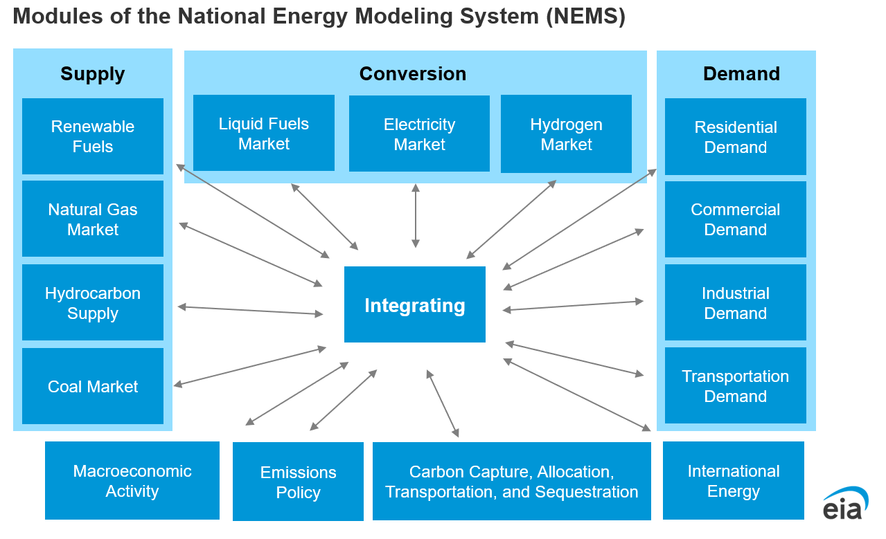

Overview of the Structure of NEMS
====================================

Background
~~~~~~~~~~

NEMS is structured as a modular system. The modules include the
Integrating Module and a series of relatively independent modules that
represent the domestic energy system, the international energy market,
and the economy. The domestic energy system is broken down further into
fuel supply markets, conversion activities, and end-use consumption
sectors.

Model modularity implies a system of self-contained units, each
performing a specific, well-defined function. This concept is generally
consistent with the economic structure of energy markets, which can be
represented by various supply, conversion, and demand components that
are largely separable. Because energy markets are heterogeneous, a
single methodology cannot adequately represent all aspects of supply,
conversion, and end-use demand sectors. The modularity of the NEMS
design provides the flexibility for each component to use the
methodology and regional coverage that is most appropriate for the
required analyses.

NEMS can execute the modules individually or in subsets. This
flexibility fosters independent module development, a distribution of
model development work organized by energy market specialties, and
incremental development of the system. Several modules are further
broken down into submodules for development and documentation purposes.

To support modularity, the information flow between modules is
centralized. The data linkages between modules are implemented through
the NEMS Global Data Structure (GDS). The Global Data Structure
(discussed in more detail in Chapter 3) is the set of data communicated
between the NEMS modules or used in the NEMS output reports. Individual
NEMS modules access the GDS data they need for input and update the GDS
variables that store their module’s output.

Figure 1. Basic National Energy Modeling System (NEMS) structure and
information flow

|Diagram AI-generated content may be incorrect.|

Data source: U.S. Energy Information Administration

The primary data flow among the modules are the delivered prices of
energy and how much energy is consumed by product, region, and sector.
The information flows among modules are not limited to prices and
quantities, and they include other information such as economic
activity, capital expenditures, and supply curves.

Many NEMS modules simulate the economic decision-making involved in the
sector of the energy system being modeled. To represent these decisions,
NEMS is constructed with reasonably fine detail of energy product
categories and the regional locations of energy production and use. This
detail is necessary because the economics of allocating energy products
is strongly influenced by the product category at issue and regional
differences in costs and other factors.

The Integration Module
~~~~~~~~~~~~~~~~~~~~~~~~~~~~~~~~~~

Key Tasks
~~~~~~~~~~~~~~~~

The integration code is the spine of NEMS. It calls most of the
individual modules and manages the model’s underlying functions and
operations—setup, job queue, calculations, and output production.

The integration code manages operations during **setup.**

- It provides a graphical user interface and a command line interface to
  the system.

- It sets up the folders for a run.

- It compiles, using the meson build system, the Fortran code that is
  used in the run.

- It preprocesses any data that is being loaded in from exterior
  systems.

- It manages and loads shared configuration files.

The integration code includes the **job queue.**

- It dispatches jobs from the user, to the run queue server, and then to
  the worker machines.

- It activates workers (which process NEMS jobs) and manages their
  operations.

- It manages the RabbitMQ and celery server that dispatches the jobs.

- It provides a monitor for the job queue, to review job status.

The integration code manages **calculations** during the main NEMS loop.

- It ingests data from disk, and loads it into memory.

- It manages the flow of program calls.

- It modifies data when the modifications are cross-cutting, or the
  calculations are performed in the integration code for some legacy
  reason.

- It tests convergence, and determines when the mode should stop
  running. If directed, it applies a relaxation algorithm.

- The integration code writes files and reports to disk where needed.

The integration code includes the NEMS **post processes.**

- The NEMS Report Writer produces all external NEMS reports.

- The NEMS validator, a simple set of checks, evaluates whether results
  have errors preventing publication.

- The cleanup code manages the cleanup (deletion of temporary files,
  compression, etc) of NEMS files after a NEMS run completes.

