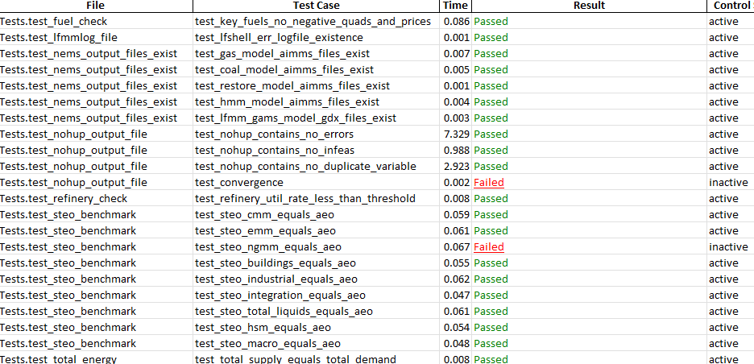

The NEMS Validator
==================

The NEMS Validator, a python program written using the
`pytest <https://docs.pytest.org/en/stable/>`__ framework, tests NEMS
results to see if they are appropriate for publication. After each NEMS
run is completed, the validator runs checks that answer questions such
as:

1. Are there error codes in any NEMS logs?

2. Is NEMS properly calibrated to STEO and SEDS?

3. Do select subtotals add to the appropriate totals?

4. Do expected output files exist?

5. Are energy prices and quantities all positive?

6. Does total energy supply equal total demand?

7. Did the model converge?

If all tests are successful the validator writes out, in a root
directory of the run, a file named “Validator_pass.xlsx.” Conversely, if
any test fails, the validator names the files “Validator_fail.xslx.”

Tests can be active, inactive, or off. Inactive tests run, but a failed
results does not affect the file name being “fail” or “pass.”

Figure 9: Sample Validator Tests

|Graphical user interface, table AI-generated content may be incorrect.|

